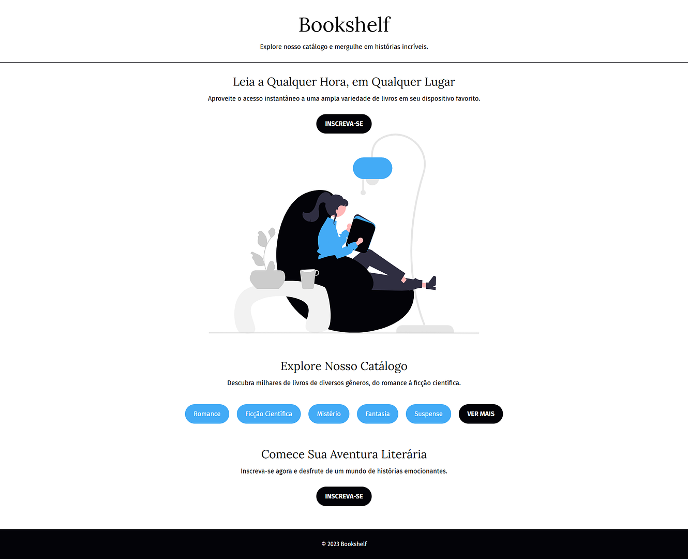

# Bookshelf - Projeto HTML5 e CSS3

Este é um projeto desenvolvido com foco na prática de **HTML5 e CSS3**, com o objetivo de reforçar os conceitos de **estruturação semântica**, **tipografia** e **estilização de botões e listas**.  
A proposta é simular uma página institucional de um serviço de biblioteca digital, incentivando o hábito da leitura e a exploração de diversos gêneros literários.

---

## 📁 Estrutura de Arquivos

- `index.html`  
  Página principal com seções de introdução, catálogo de gêneros e chamada para ação.

- `style.css`  
  Arquivo de estilos responsável pela aparência visual da página, como fontes, cores e disposição dos elementos.

- `img/`  
  Pasta que armazena imagens utilizadas no projeto, como ilustrações temáticas de leitura.

---

## 📚 Aprendizados com o Projeto

- Estruturação de uma página HTML5 com uso adequado de `<header>`, `<main>`, `<section>` e `<footer>`.
- Aplicação de tipografia personalizada com Google Fonts (`Fira Sans` e `Lora`).
- Estilização de botões com `border-radius`, `background-color` e `text-transform`.
- Organização de conteúdo em listas estilizadas e botões

---

## 🖼️ Prévia Visual

### 📚 Bookshelf - Leitura em Qualquer Lugar

---

## 📝 Licença

Este projeto tem caráter **educacional** e foi desenvolvido para **prática pessoal** de HTML5 e CSS3.  
Fique à vontade para estudar, adaptar e utilizar como base em seus próprios projetos!